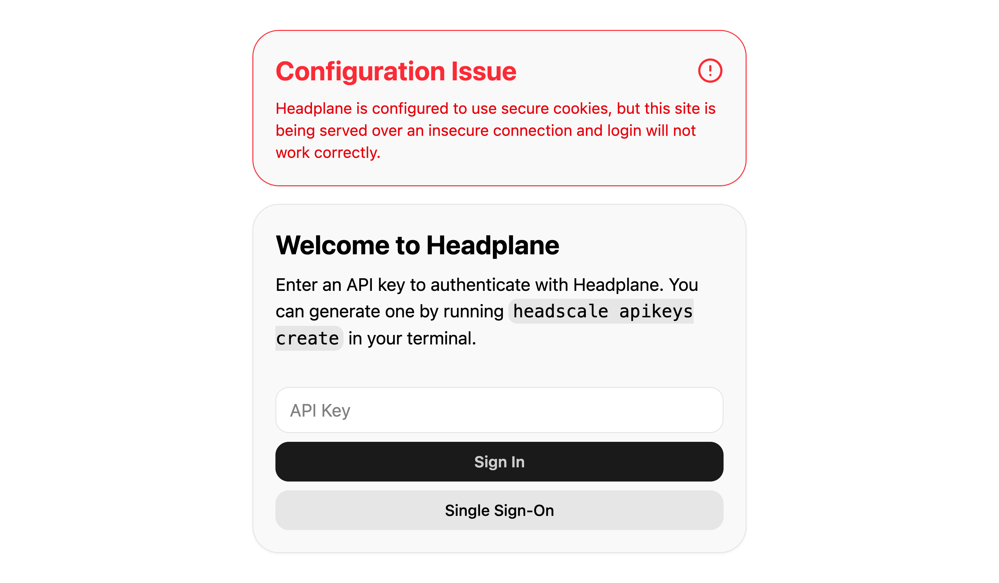

# Common Issues and Their Solutions

This document outlines some common issues users may encounter while using Headplane, along with their solutions.

## Login does not work

::: tip
Headplane tries to detect misconfigurations and will surface a warning banner on
the login page if it detects any abnormalities. You may see a banner like this:

<figure>
    
    
    <figcaption>Login Warning Banner</figcaption>
</figure>
:::

If you attempt to log in to Headplane but nothing happens, it may be due to a
misconfiguration of the server cookie settings. In your Headplane configuration,
ensure that `server.cookie_secure` is set appropriately based on how you are
accessing Headplane:

- Serving over HTTPS: `cookie_secure` should be enabled (`true`).
- Serving over HTTP: `cookie_secure` should be disabled (`false`).

### "Session cookie is empty" or repeated login errors

An empty `_hp_auth` cookie is not a valid session. It can remain after a logout
or failed session cleanup if the browser received a cookie deletion response
with a positive `Max-Age`.

1. Upgrade Headplane to a version that deletes sessions with `Max-Age=0`.
2. Clear the `_hp_auth` cookie for the Headplane domain, then retry the login.
3. In browser developer tools, verify that the logout or invalid-session
   response sends `Set-Cookie` with both `Max-Age=0` and an expired `Expires`
   value.

`cookie_secure: true` is still required when the public Headplane URL uses
HTTPS, including when TLS terminates at a reverse proxy. It controls whether a
cookie may be sent over HTTP; it does not by itself explain an empty cookie.

### Password login redirects back to the login page

Password login needs a server-side Headscale API key to load machines and other
dashboard data. The password-session token only authenticates Headplane-specific
endpoints; it is not a Headscale API key.

Configure a valid, unexpired administrative API key for Headplane and restart
the service:

```yaml
headscale:
  api_key: "<headscale-api-key>"
```

Keep this key server-side. Do not put it in the browser, a public reverse-proxy
configuration, or a client-side environment variable. If the issue persists,
check the Headplane logs for `Live store: failed to poll nodes` or
`Live store: failed to poll users`, then verify the configured key has not been
revoked or expired.
